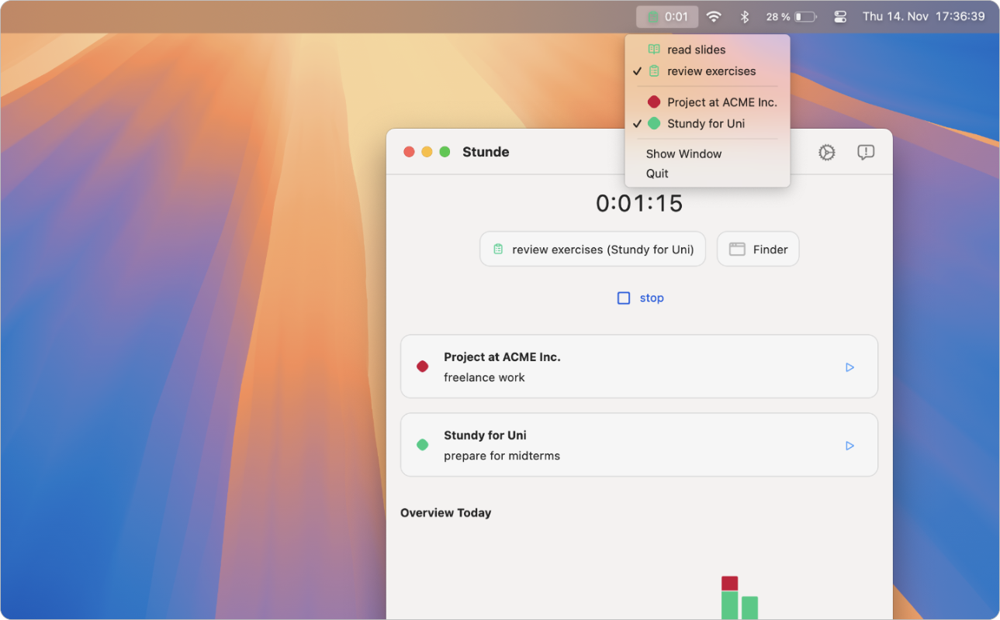
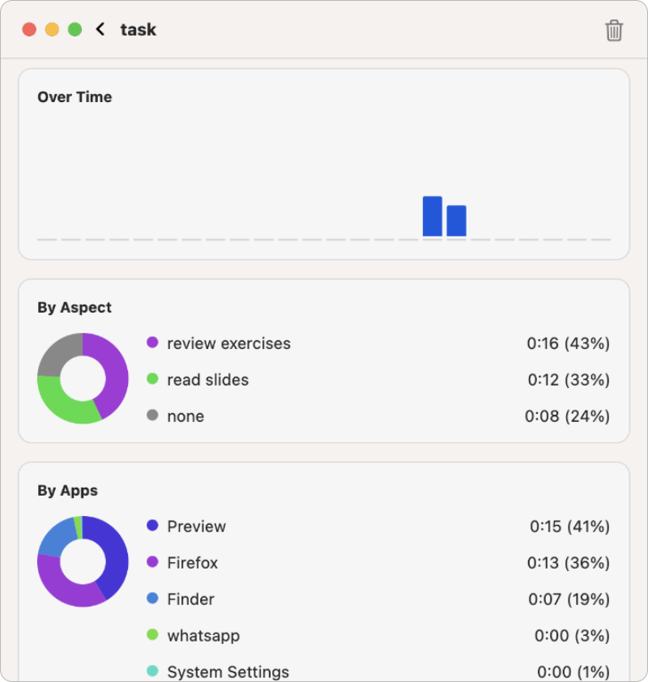

# Stunde __

Stunde is a simple timekeeper for macOS. It allows you to track the time you spent on different projects. It is designed to be simple and easy to use. It runs in the menu bar and does not require any setup. It was designed for freelancers, students, and anyone who needs to track their time. You can also export your time entries to a CSV file. The app is open-source and free to use.

### Screenshots

__
__

### Install

1. download it from the [macOS App Store](https://apps.apple.com/de/app/stunde-timekeeping/id6738203776)

### contribute

- you can build the application yourself using [Flutter](https://flutter.dev)
- feel free to reach out if you find issues or have suggestions

Have a great day, 
Yours, Robin

